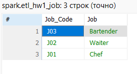

# Урок 1. Модели данных и нормализация таблиц. Схема «звезда»

## Задание 3
Определите в какой нормальной форме данная таблица, приведите её ко 2 и 3 нормальным формам последовательно.

--------
## Cкриншоты выполнения задания: 

Первая нормальная форма, в каждой ячейке одно значение

